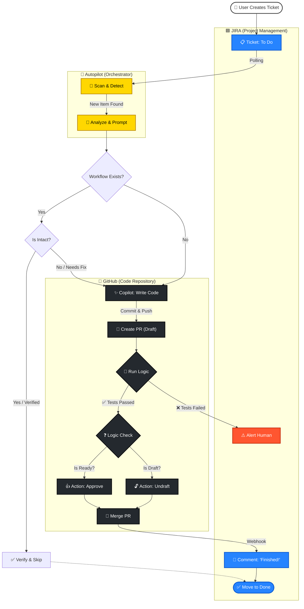

# Jira Autopilot & GitHub Automation Service 🚀

A comprehensive Node.js automation service that bridges Jira and GitHub. It acts as an autonomous agent that polls Jira for tickets, intelligently detects project requirements (Language, Repo), and generates remote CI/CD workflows via GitHub Pull Requests.


## Prerequisites

-   **Node.js** (v18 or higher)
-   **Jira Account** (Cloud) with an API Token.
-   **GitHub Account** with a Personal Access Token (Classic) having `repo`, `workflow`, and `read:user` scopes.

## Features ✨

-   **Autopilot Polling**: Automatically polls Jira every 30 seconds for new tickets.
-   **Dynamic Project Discovery**: Automatically detects all available Jira projects (no need to hardcode keys).
-   **AI-Powered agent (Optional)**: Enable `USE_GH_COPILOT=true` to unlock:
    -   **AI Code Fixes**: Automatically applies code fixes tailored to Jira requirements before PR.
    -   **AI Workflow Generation**: Generates custom CI/CD pipelines instead of static templates.
    -   **Sub-PR Management**: Detects, un-drafts, and auto-merges Pull Requests created by `@copilot`.
-   **Smart Language Detection**: Automatically parsing repository files to detect the tech stack:
    -   `package.json` → **Node.js**
    -   `*.csproj` / `*.sln` → **.NET**
    -   `requirements.txt` → **Python**
    -   `pom.xml` / `build.gradle` → **Java**
-   **Priority Queue**: Processes tickets based on Priority (Highest -> Lowest).
-   **Stable PR Workflow**: Creates specific feature branches (`chore/{key}-workflow-setup`) and opens Pull Requests.
-   **Persistent Logging**: Server activity is logged to `logs/server.log`.
-   **Live Dashboard**: Real-time UI at `http://localhost:3000` showing:
    -   Active Queue & History
    -   **Live CI/CD Checks**: See the status of checks (e.g., "Build", "Tests") on the cards directly.
    -   Quick Links to Jira Tickets and GitHub PRs.
-   **mcp-server**: Built-in Model Context Protocol server for AI Agents (Claude Desktop, etc.).
-   **Security**: Integrated CodeQL scans.
-   **Dynamic Branching**: Automatically detects standard branches (`main`, `master`, `dev`).
-   **Container Ready**: Generates `Dockerfile` for all Azure Web App deployments.

## CLI Paths

-   **GitHub CLI (gh)**: `C:\Program Files\GitHub CLI\gh.exe`
-   **Git (git)**: `C:\Program Files\Git\cmd\git.exe`

## Container Registry (ACR Only)

-   **Registry**: `mvacrdemo.azurecr.io`
-   **GitHub Secrets required**:
    -   `ACR_LOGIN_SERVER` = `mvacrdemo.azurecr.io`
    -   `ACR_USERNAME` = ACR admin or service principal appId
    -   `ACR_PASSWORD` = ACR password or service principal secret
-   **Tag format**: `${{ secrets.ACR_LOGIN_SERVER }}/${{ env.REPO_LOWER }}:latest` and `:${{ github.sha }}`
-   The workflow computes `REPO_LOWER` from `${{ github.repository }}` to ensure lowercase tags.

## Azure Web App Deploy Secrets

For publish-profile zip deploy to Azure Web Apps, ensure the target repository has these GitHub Actions secrets configured:

- `AZURE_WEBAPP_APP_NAME`: The Web App name (e.g., `myapp-web`)
- `AZURE_WEBAPP_SLOT_NAME`: The deployment slot (e.g., `production`)
- `AZURE_WEBAPP_PUBLISH_PROFILE`: The full publish profile XML content

These are referenced by the generated workflow in the `deploy` job using `azure/webapps-deploy@v2`.

## Prerequisites

-   **Node.js** (v18 or higher)
-   **Jira Account** (Cloud) with an API Token.
-   **GitHub Account** with a Personal Access Token (Classic) having `repo`, `workflow`, and `read:user` scopes.

## Setup & Installation

1.  **Clone the repository**:
    ```bash
    git clone <your-repo-url>
    cd AUTOMATION
    ```

2.  **Install dependencies**:
    ```bash
    npm install
    ```

3.  **Configure Environment**:
    Create a `.env` file in the root directory:
    ```env
    GHUB_TOKEN=ghp_your_github_token_here
    JIRA_BASE_URL=https://your-domain.atlassian.net
    JIRA_USER_EMAIL=your-email@example.com
    JIRA_API_TOKEN=your_jira_api_token
    JIRA_PROJECT_KEY=PROJ,ECT
    PORT=3000
    ```

## Usage

### Run Locally
```bash
npm start
```
-   **Dashboard**: `http://localhost:3000`
-   **MCP Server** (Manual): `npm run start:mcp` (Usually run by AI Client)

### Run with Docker 🐳
Build and run the containerized application:
```bash
docker build -t jira-automation .
docker run -p 3000:3000 --env-file .env jira-automation
```

### Running Tests
Execute the Jest unit tests:
```bash
npm test
```

## Security Scans 🔒

The generated pipelines include built-in security checks. Here is where to find the results:

1.  **CodeQL (Source Code)**:
    *   **In PR**: Look for "Code scanning results" checks at the bottom of the Pull Request.
    *   **Dashboard**: Go to your Repo > **Security** tab > **Code scanning**.

2.  **Container Scanning**:
    *   Trivy has been removed per current policy; can be re-enabled later.

## AI Integration (MCP) 🤖
This project includes an **MCP Server** (`mcpServer.js`).
Add this to your Claude Desktop config to give your AI access to the agent's tools:
```json
"mcpServers": {
  "jira-autopilot": {
    "command": "node",
    "args": ["/absolute/path/to/AUTOMATION/mcpServer.js"]
  }
}
```
**Capabilities:**
-   `autopilot://status`: Read live system status.
-   `generate_workflow_yaml`: Ask AI to draft a CI file using the service's logic.
-   `check_pr_status`: Ask AI to check if a specific PR is passing.

## Architecture

See [agents.md](./agents.md) for detailed agent specifications.

### Workflow Diagram



## License

MIT

## Configuration: Per-board Post-PR Status

You can configure a per-board (project) status that the service will transition Jira tickets to after a PR is created or verified. The precedence is:

- `config/board_post_pr_status.json` mapping (project key or project name)
- `POST_PR_STATUS` environment variable
- default: `In Progress`

Create `config/board_post_pr_status.json` with a JSON object mapping project keys (e.g. `NDE`) or project names to the desired status. Example:

```
{
    "NDE": "In Review",
    "MKT": "In Development",
    "OPS": "In Progress"
}
```

Notes:
- The service will only transition a ticket to `Done` when deployment is detected by the CI checks.
- If no mapping is found for a project, the `POST_PR_STATUS` env var will be used; otherwise `In Progress` is used.

