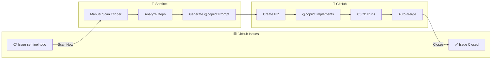
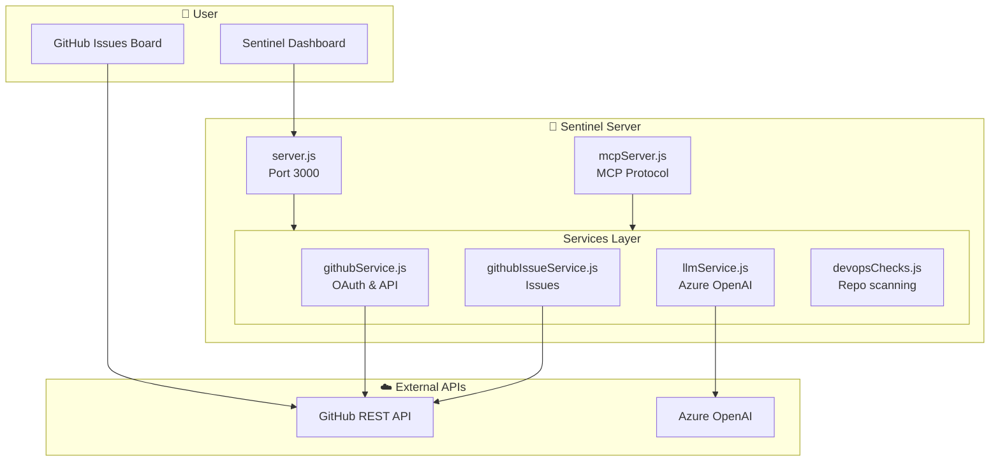
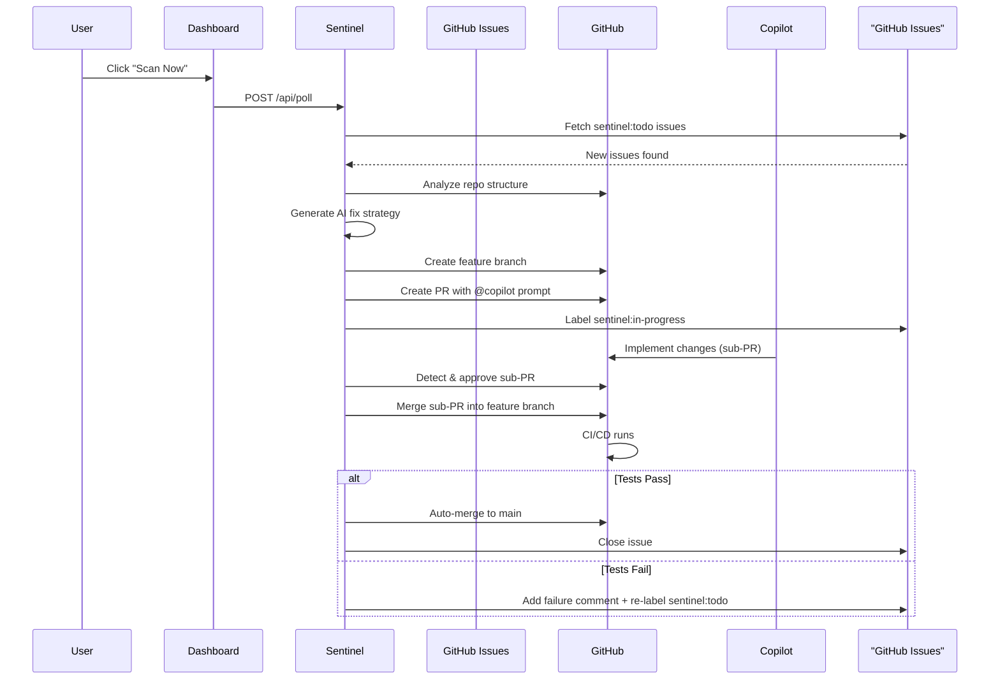

# Sentinel 🛡️

> **Autonomous DevOps Orchestrator — GitHub Issues → GitHub PRs**

[](https://portal.azure.com/#create/Microsoft.Template/uri/https%3A%2F%2Fraw.githubusercontent.com%2FUnigalactix%2FSENTINEL%2Fmain%2Fazuredeploy.json)
[](https://sentineldevagent.azurewebsites.net)
[](https://github.com/apps/sentinel-devops-automation-agent)

Sentinel monitors GitHub Issues, automatically creates Pull Requests with CI/CD workflows, and uses AI to implement issue requirements—closing the loop from "sentinel:todo" to "Done" with minimal human intervention. Scans are triggered manually via the **Scan Now** button in the dashboard, or via the `/api/poll` endpoint.

---

## How It Works


```mermaid
flowchart LR
    subgraph ISSUES["🟩 GitHub Issues"]
        T1[📋 Issue sentinel:todo]
        T2[✅ Issue Closed]
    end

    subgraph SENTINEL["🤖 Sentinel"]
        S1[Manual Scan Trigger]
        S2[Analyze Repo]
        S3[Generate @copilot Prompt]
    end

    subgraph GITHUB["🐙 GitHub"]
        G1[Create PR]
        G2["@copilot Implements"]
        G3[CI/CD Runs]
        G4[Auto-Merge]
    end

    T1 -->|"Scan Now"| S1
    S1 --> S2 --> S3 --> G1
    G1 --> G2 --> G3 --> G4
    G4 -->|"Closes"| T2
```

---

## Screenshots

> UI references – capture your own screenshots and save them under `docs/ui/` using the filenames below.

- **Dashboard Overview**  
    

- **Login & Install Flow**  
    

- **Ticket Processing & Logs**  
    

- **Sidebar Status Panel**  
    

These images are not committed by default; when updating the UI, also refresh the corresponding screenshot in `docs/ui/` so new users can see the latest experience.

---

## Key Features

| Feature | Description |
|---------|-------------|
| **Manual Scan** | Trigger a GitHub Issues scan on demand via the **Scan Now** button or `POST /api/poll` |
| **Multi-Tenant Auth** | Multiple users can log in simultaneously, each with isolated agent contexts |
| **Per-User OAuth** | Uses GitHub OAuth to perform actions as the logged-in user |
| **AI Analysis** | Uses Azure OpenAI to analyze repos and plan fixes |
| **Smart Detection** | Auto-detects Node/Python/.NET/Java from repo files |
| **@copilot Integration** | Posts context-aware prompts to trigger GitHub Copilot |
| **Secret Placeholders** | Uses `${{ secrets.X }}` in workflows—never exposes values |
| **Sub-PR Management** | Detects, approves, and merges Copilot-generated PRs |
| **Live Dashboard** | Real-time UI with phase indicator, terminal feed, agent badge, and inspection panel |
| **Repo Inspection** | On-demand repo health scan that auto-creates a GitHub Issue with findings |
| **Cloud Deployment** | Azure Web App deployment with Docker support |
| **MCP Server** | Exposes tools for AI agents (Claude, VS Code Copilot) |

---

## Architecture


```mermaid
flowchart TB
    subgraph Client["👤 User"]
        GH_ISSUES[GitHub Issues Board]
        DASHBOARD[Sentinel Dashboard]
    end

    subgraph Sentinel["🤖 Sentinel Server"]
        SERVER[server.js<br/>Port 3000]
        MCP[mcpServer.js<br/>MCP Protocol]
        
        subgraph Services["Services Layer"]
            gh[githubService.js<br/>OAuth & API]
            GH_ISSUE_SVC[githubIssueService.js<br/>Issues]
            LLM[llmService.js<br/>Azure OpenAI]
            DEVOPS[devopsChecks.js<br/>Repo scanning]
        end
    end

    subgraph External["☁️ External APIs"]
        GH_API[GitHub REST API]
        AZURE[Azure OpenAI]
    end

    GH_ISSUES --> GH_API
    DASHBOARD --> SERVER
    SERVER --> Services
    gh --> GH_API
    GH_ISSUE_SVC --> GH_API
    LLM --> AZURE
    MCP --> Services
```

---

## Quick Start

### 1. Install
```bash
git clone https://github.com/Unigalactix/SENTINEL.git
cd SENTINEL
npm install
```

### 2. Configure `.env`
```env
# GitHub OAuth (Required for Per-User Auth)
OAUTH_CLIENT_ID=your_client_id
OAUTH_CLIENT_SECRET=your_client_secret

# GitHub Issues (Required)
GITHUB_ISSUES_REPO=owner/repo          # Repository to poll for sentinel:todo issues
GITHUB_ISSUES_LABEL=sentinel:todo      # Label that marks issues for processing (default: sentinel:todo)
GHUB_TOKEN=ghp_...                     # Personal access token (fallback when no OAuth user)
GHUB_ORG=YourOrg                       # GitHub organization for PR reconciliation

# AI (Optional — enables agentic analysis)
LLM_API_KEY=your_azure_openai_key
LLM_ENDPOINT=https://your-resource.openai.azure.com
LLM_DEPLOYEMENT_NAME=gpt-4o
USE_GH_COPILOT=true

# Session
SESSION_SECRET=your_random_secret
```

### 3. Run
```bash
npm start          # Start server at http://localhost:3000
npm run start:mcp  # Start MCP server for AI agents
```

---

## Project Structure

```
SENTINEL/
├── server.js              # Main orchestrator (manual scan, API, multi-tenant agents)
├── mcpServer.js           # MCP server for AI agents
├── CHANGELOG.md           # Version history & change tracking
├── public/
│   └── index.html         # Live dashboard UI (Scan Now, feed, agent badge)
├── src/
│   ├── services/
│   │   ├── githubService.js       # GitHub API (42+ exports, PR management)
│   │   ├── githubIssueService.js  # GitHub Issues API (poll, create, update, comment)
│   │   ├── authService.js         # OAuth handling
│   │   ├── llmService.js          # Azure OpenAI integration
│   │   └── devopsChecks.js        # Repo scanning
│   └── tools/
│       └── definitions.js         # MCP tool definitions
├── scripts/
│   └── inspect_repo.js    # Standalone repo inspector (creates GitHub Issues with findings)
├── __tests__/
│   └── exports.test.js    # Export verification tests
├── config/
│   └── board_post_pr_status.json
├── docs/                  # Project documentation
│   ├── agents.md          # Agent architecture & changelog reminder
│   ├── github-issues-setup.md  # GitHub Issues labels & config guide
│   ├── DETAILED_WORKFLOW.md
│   ├── PROJECT_REPORT.md
│   ├── workflow-flow.md
│   ├── suggestions.md
│   └── vscode_integration.md
├── logs/
│   └── server.log
└── Dockerfile             # Container definition
```

---

## Workflow Lifecycle


```mermaid
sequenceDiagram
    participant User
    participant Dashboard
    participant Sentinel
    participant GitHub Issues
    participant GitHub
    participant Copilot

    User->>Dashboard: Click "Scan Now"
    Dashboard->>Sentinel: POST /api/poll
    Sentinel->>"GitHub Issues": Fetch sentinel:todo issues
    "GitHub Issues"-->>Sentinel: New issues found
    
    Sentinel->>GitHub: Analyze repo structure
    Sentinel->>Sentinel: Generate AI fix strategy
    Sentinel->>GitHub: Create feature branch
    Sentinel->>GitHub: Create PR with @copilot prompt
    Sentinel->>"GitHub Issues": Label sentinel:in-progress
    
    Copilot->>GitHub: Implement changes (sub-PR)
    Sentinel->>GitHub: Detect & approve sub-PR
    Sentinel->>GitHub: Merge sub-PR into feature branch
    
    GitHub->>GitHub: CI/CD runs
    alt Tests Pass
        Sentinel->>GitHub: Auto-merge to main
        Sentinel->>"GitHub Issues": Close issue
    else Tests Fail
        Sentinel->>"GitHub Issues": Add failure comment + re-label sentinel:todo
    end
```

---

## @copilot Prompt Format

Sentinel generates **context-aware prompts** (not hardcoded YAML):

```markdown
@copilot /fix **GH-123: Add user authentication**

[Description from GitHub Issue]

---
## 🤖 AI Analysis
[AI-generated fix strategy based on repo analysis]

---
## Repository Context
| Property | Value |
|----------|-------|
| **Repo** | Org/RepoName |
| **Language** | node |
| **Available Secrets** | ${{ secrets.ACR_LOGIN_SERVER }}, ... |

> **Note:** This repository already has a CI/CD workflow.

## Guidelines
1. Read the entire repository first
2. Use secret placeholders—never hardcode values
3. Only create workflows if needed
```

---

## NPM Scripts

| Command | Description |
|---------|-------------|
| `npm start` | Run the server |
| `npm run start:mcp` | Run MCP server for AI agents |
| `npm test` | Run all Jest tests |
| `npm run test:exports` | Verify all function exports |
| `npm run lint` | Run ESLint |
| `npm run verify` | Lint + export tests |

---

## MCP Integration

Add to Claude Desktop's `config.json`:

```json
{
  "mcpServers": {
    "sentinel": {
      "command": "node",
      "args": ["C:/path/to/SENTINEL/mcpServer.js"]
    }
  }
}
```

**Available Tools:**
- `sentinel://status` — Live system status
- `generate_workflow_yaml` — Generate CI/CD workflow
- `check_pr_status` — Check PR status

---

## GitHub Secrets for Workflows

| Secret | Purpose |
|--------|---------|
| `ACR_LOGIN_SERVER` | Azure Container Registry URL |
| `ACR_USERNAME` | ACR username |
| `ACR_PASSWORD` | ACR password |
| `AZURE_WEBAPP_APP_NAME` | Web App name |
| `AZURE_WEBAPP_PUBLISH_PROFILE` | Publish profile XML |
| `OAUTH_CLIENT_ID` | GitHub OAuth App Client ID |
| `OAUTH_CLIENT_SECRET` | GitHub OAuth App Client Secret |
| `GITHUB_ISSUES_REPO` | `owner/repo` for the issues board |
| `GITHUB_ISSUES_LABEL` | Label for pending issues (default: `sentinel:todo`) |
| `LLM_API_KEY` | Azure OpenAI API Key |
| `LLM_ENDPOINT` | Azure OpenAI endpoint URL |
| `SESSION_SECRET` | Session Encryption Key |

---

## Changelog

See [CHANGELOG.md](CHANGELOG.md) for version history and detailed change tracking.

---

## License

MIT
