# Sentinel 🛡️

> **Autonomous DevOps Orchestrator for Jira ↔ GitHub**

Sentinel continuously monitors Jira boards, automatically creates GitHub PRs with CI/CD workflows, and uses AI to implement ticket requirements—closing the loop from "To Do" to "Done" with minimal human intervention.

---

## How It Works

```mermaid
flowchart LR
    subgraph JIRA["🟦 Jira"]
        T1[📋 Ticket Created]
        T2[✅ Done]
    end

    subgraph SENTINEL["🤖 Sentinel"]
        S1[Poll every 30s]
        S2[Analyze Repo]
        S3[Generate @copilot Prompt]
    end

    subgraph GITHUB["🐙 GitHub"]
        G1[Create PR]
        G2["@copilot Implements"]
        G3[CI/CD Runs]
        G4[Auto-Merge]
    end

    T1 -->|"New ticket"| S1
    S1 --> S2 --> S3 --> G1
    G1 --> G2 --> G3 --> G4
    G4 -->|"Webhook"| T2
```



---

## Key Features

| Feature | Description |
|---------|-------------|
| **Auto-Polling** | Scans Jira every 30s for new "To Do" tickets |
| **AI Analysis** | Uses Azure OpenAI to analyze repos and plan fixes |
| **Smart Detection** | Auto-detects Node/Python/.NET/Java from repo files |
| **@copilot Integration** | Posts context-aware prompts to trigger GitHub Copilot |
| **Secret Placeholders** | Uses `${{ secrets.X }}` in workflows—never exposes values |
| **Sub-PR Management** | Detects, approves, and merges Copilot-generated PRs |
| **Live Dashboard** | Real-time UI at `http://localhost:3000` |
| **MCP Server** | Exposes tools for AI agents (Claude, etc.) |

---

## Architecture

```mermaid
flowchart TB
    subgraph Client["👤 User"]
        JIRA_UI[Jira Board]
        DASHBOARD[Sentinel Dashboard]
    end

    subgraph Sentinel["🤖 Sentinel Server"]
        SERVER[server.js<br/>Port 3000]
        MCP[mcpServer.js<br/>MCP Protocol]
        
        subgraph Services["Services Layer"]
            GH[githubService.js<br/>34 functions]
            JIRA_SVC[jiraService.js<br/>8 functions]
            LLM[llmService.js<br/>Azure OpenAI]
            DEVOPS[devopsChecks.js<br/>Repo scanning]
        end
    end

    subgraph External["☁️ External APIs"]
        JIRA_API[Jira REST API]
        GH_API[GitHub REST API]
        AZURE[Azure OpenAI]
    end

    JIRA_UI --> JIRA_API
    DASHBOARD --> SERVER
    SERVER --> Services
    GH --> GH_API
    JIRA_SVC --> JIRA_API
    LLM --> AZURE
    MCP --> Services
```



---

## Quick Start

### 1. Install
```bash
git clone https://github.com/Unigalactix/SENTINEL.git
cd SENTINEL
npm install
```

### 2. Configure `.env`
```env
# GitHub
GHUB_TOKEN=ghp_xxxxxxxxxxxx
GH_ORG_NAME=YourOrg

# Jira
JIRA_BASE_URL=https://your-domain.atlassian.net
JIRA_USER_EMAIL=you@example.com
JIRA_API_TOKEN=your_jira_token

# AI (Optional)
AZURE_OPENAI_API_KEY=your_key
AZURE_OPENAI_ENDPOINT=https://your-resource.openai.azure.com
AZURE_OPENAI_DEPLOYMENT=gpt-4o
USE_GH_COPILOT=true
```

### 3. Run
```bash
npm start          # Start server at http://localhost:3000
npm run start:mcp  # Start MCP server for AI agents
```

---

## Project Structure

```
SENTINEL/
├── server.js              # Main orchestrator (polling, API)
├── mcpServer.js           # MCP server for AI agents
├── public/
│   └── index.html         # Live dashboard UI
├── src/
│   ├── services/
│   │   ├── githubService.js   # 34 GitHub API functions
│   │   ├── jiraService.js     # Jira API (tickets, transitions)
│   │   ├── llmService.js      # Azure OpenAI integration
│   │   └── devopsChecks.js    # Repo scanning
│   └── tools/
│       └── definitions.js     # MCP tool definitions
├── scripts/
│   └── inspect_repo.js    # Standalone repo inspector
├── __tests__/
│   └── exports.test.js    # Export verification (51 tests)
├── config/
│   └── board_post_pr_status.json
└── logs/
    └── server.log
```

---

## Workflow Lifecycle


---

## @copilot Prompt Format

Sentinel generates **context-aware prompts** (not hardcoded YAML):

```markdown
@copilot /fix **PROJ-123: Add user authentication**

[Description from Jira ticket]

---
## 🤖 AI Analysis
[AI-generated fix strategy based on repo analysis]

---
## Repository Context
| Property | Value |
|----------|-------|
| **Repo** | Org/RepoName |
| **Language** | node |
| **Available Secrets** | ${{ secrets.ACR_LOGIN_SERVER }}, ... |

> **Note:** This repository already has a CI/CD workflow.

## Guidelines
1. Read the entire repository first
2. Use secret placeholders—never hardcode values
3. Only create workflows if needed
```

---

## NPM Scripts

| Command | Description |
|---------|-------------|
| `npm start` | Run the server |
| `npm run start:mcp` | Run MCP server for AI agents |
| `npm test` | Run all Jest tests |
| `npm run test:exports` | Verify all function exports |
| `npm run lint` | Run ESLint |
| `npm run verify` | Lint + export tests |

---

## MCP Integration

Add to Claude Desktop's `config.json`:

```json
{
  "mcpServers": {
    "sentinel": {
      "command": "node",
      "args": ["C:/path/to/SENTINEL/mcpServer.js"]
    }
  }
}
```

**Available Tools:**
- `sentinel://status` — Live system status
- `generate_workflow_yaml` — Generate CI/CD workflow
- `check_pr_status` — Check PR status

---

## GitHub Secrets for Workflows

| Secret | Purpose |
|--------|---------|
| `ACR_LOGIN_SERVER` | Azure Container Registry URL |
| `ACR_USERNAME` | ACR username |
| `ACR_PASSWORD` | ACR password |
| `AZURE_WEBAPP_APP_NAME` | Web App name |
| `AZURE_WEBAPP_PUBLISH_PROFILE` | Publish profile XML |

---

## License

MIT
