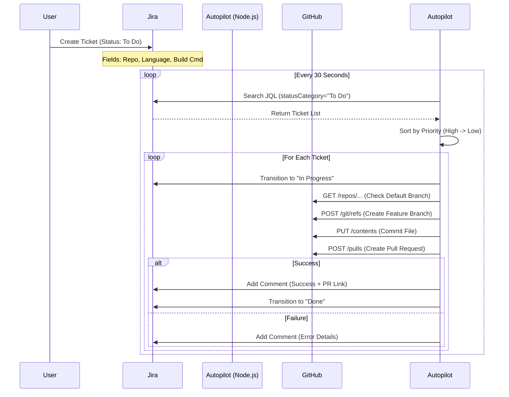

# Automation Service Workflow

This document outlines the end-to-end workflow of the Jira Autopilot Service.

## System Architecture

The service bridges Jira and GitHub using a Node.js middleware.



## Generated Workflow Example

For a Jira ticket specifying:
- **Language**: `node`
- **Repo**: `Unigalactix/sample-node-project`
- **Build**: `npm run build`

The service generates a **Pull Request** which adds the following `.yml` file:

```yaml
name: CI Pipeline - Unigalactix/sample-node-project
on:
  push:
    branches: [ "main" ]
jobs:
  build:
    runs-on: ubuntu-latest
    steps:
      - uses: actions/checkout@v4
      
      # Dynamic Language Setup
      - name: Set up Node.js
        uses: actions/setup-node@v4
        with:
          node-version: '20'
      - name: Install dependencies
        run: npm ci
      
      - name: Running NPM Audit
        run: |
          if [ -f "package-lock.json" ]; then
            npm audit --production --json || true
          fi

      # Custom Commands from Jira
      - name: Build
        run: npm run build
      - name: Test
        run: npm test
```
