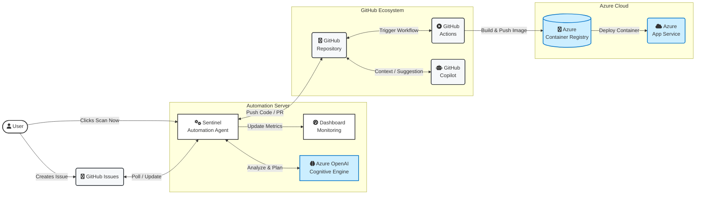
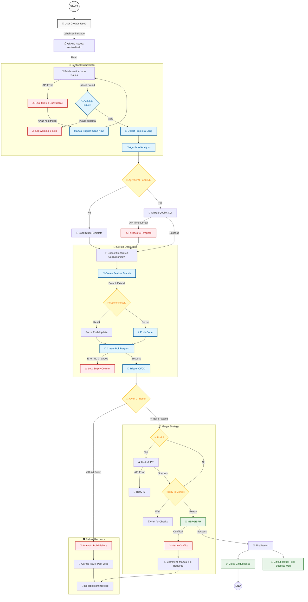

# System Architecture & Workflow Specification

**Project:** Sentinel DevOps Orchestrator  
**Version:** 3.0.0  
**Document Type:** Architecture Overview  

---

## 1. Executive Summary

This document details the architectural workflow of the **Sentinel** system. It serves as a blueprint for the automation logic, defining data flow between the core orchestration engine (`server.js`), the GitHub Issues board, and the GitHub repository ecosystem. This specification includes "What-If" failure analysis to ensure system resilience.

## BASIC HIGH LEVEL WORKFLOW

```mermaid
flowchart LR
    %% Define Styles
    classDef plain fill:#fff,stroke:#333,stroke-width:2px;
    classDef azure fill:#cceeff,stroke:#0072C6,stroke-width:2px;
    classDef gh fill:#f6f8fa,stroke:#24292e,stroke-width:2px;

    %% Nodes
    User([fa:fa-user User]):::plain
    GHIssues(fa:fa-github GitHub Issues):::gh

    subgraph "Automation Server"
        Agent[fa:fa-cogs Sentinel<br/>Automation Agent]:::plain
        Dash[fa:fa-tachometer-alt Dashboard<br/>Monitoring]:::plain
        LLM[fa:fa-brain Azure OpenAI<br/>Cognitive Engine]:::azure
    end

    subgraph "GitHub Ecosystem"
        GH(fa:fa-github GitHub<br/>Repository):::gh
        Action(fa:fa-play-circle GitHub<br/>Actions):::gh
        Copilot(fa:fa-robot GitHub<br/>Copilot):::gh
    end

    subgraph "Azure Cloud"
        ACR[(fa:fa-docker Azure<br/>Container Registry)]:::azure
        AppService(fa:fa-cloud Azure<br/>App Service):::azure
    end

    %% Connections
    User -->|Creates Issue| GHIssues
    User -->|Clicks Scan Now| Agent
    GHIssues <-->|Poll / Update| Agent
    Agent -->|Update Metrics| Dash
    Agent <-->|Analyze & Plan| LLM
    
    Agent <-->|Push Code / PR| GH
    GH <-->|Context / Suggestion| Copilot
    GH <-->|Trigger Workflow| Action
    
    Action -->|Build & Push Image| ACR
    ACR -->|Deploy Container| AppService
```

## 2. Core Workflow Diagram

The following Mermaid diagram outlines the end-to-end lifecycle of a GitHub Issue as it is processed by Sentinel, including decision gates, external API interactions, and exception handling paths.

```mermaid
graph TD
    %% =========================================================================
    %% STYLES
    %% =========================================================================
    classDef actor fill:#f9f9f9,stroke:#333,stroke-width:2px;
    classDef process fill:#e1f5fe,stroke:#01579b,stroke-width:2px,color:#01579b;
    classDef decision fill:#fff9c4,stroke:#fbc02d,stroke-width:2px,color:#f57f17;
    classDef success fill:#e8f5e9,stroke:#2e7d32,stroke-width:2px,color:#1b5e20;
    classDef failure fill:#ffebee,stroke:#c62828,stroke-width:2px,color:#b71c1c;
    classDef system fill:#f3e5f5,stroke:#7b1fa2,stroke-width:2px;

    %% =========================================================================
    %% PHASE 1: INGESTION (GitHub Issues)
    %% =========================================================================
    Start((START)) --> UserAction[👤 User Creates Issue]
    UserAction -->|Label sentinel:todo| IssuesState[📋 GitHub Issues: sentinel:todo]

    subgraph ORCHESTRATOR [🤖 Sentinel Orchestrator]
        direction TB
        ScanTrigger[Manual Trigger: Scan Now]
        IssuesFetch[📡 Fetch sentinel:todo Issues]
        Validation{🔍 Validate<br/>Issue?}
        ProjectDetect[🧠 Detect Project & Lang]
        
        ScanTrigger --> IssuesFetch
        IssuesFetch -->|API Error| LogFetchError[⚠️ Log: GitHub Unavailable]
        LogFetchError -->|Await next trigger| ScanTrigger
        
        IssuesFetch -->|Issues Found| Validation
        Validation -->|Invalid schema| LogSkip[⚠️ Log warning & Skip]
        Validation -->|Valid| ProjectDetect
        
        ProjectDetect --> AgenticPhase[🧠 Agentic AI Analysis]
    end

    IssuesState -.->|Read| IssuesFetch
    class Start,UserAction actor;
    class ScanTrigger,Validation,ProjectDetect,AgenticPhase process;
    class LogFetchError,LogSkip failure;

    %% =========================================================================
    %% PHASE 2: GENERATION (AI & Git)
    %% =========================================================================
    AgenticPhase --> CheckAI{🧠 Agentic/AI Enabled?}
    
    CheckAI -->|No| TemplateGen[📄 Load Static Template]
    CheckAI -->|Yes| CopilotPrompt[🤖 GitHub Copilot CLI]
    
    CopilotPrompt -->|API Timeout/Fail| FallbackMode[⚠️ Fallback to Template]
    CopilotPrompt -->|Success| CodeGen[✨ Copilot Generated Code/Workflow]
    TemplateGen --> CodeGen
    FallbackMode --> CodeGen

    subgraph GITHUB_OPS [🐙 GitHub Operations]
        direction TB
        GitBranch[🌱 Create Feature Branch]
        GitPush[⬆️ Push Code]
        CreatePR[📝 Create Pull Request]
        
        CodeGen --> GitBranch
        GitBranch -->|Branch Exists?| HandleExisting{Reuse or Reset?}
        HandleExisting -->|Reset| GitForcePush[Force Push Update]
        HandleExisting -->|Reuse| GitPush
        GitForcePush --> CreatePR
        GitPush --> CreatePR
        
        CreatePR -->|Error: No Changes| LogNoChange[⚠️ Log: Empty Commit]
        CreatePR -->|Success| TriggerCI[🚀 Trigger CI/CD]
    end
    
    class CheckAI,HandleExisting decision;
    class GitBranch,GitPush,CreatePR,TriggerCI process;
    class FallbackMode,LogNoChange failure;

    %% =========================================================================
    %% PHASE 3: VERIFICATION (CI/CD)
    %% =========================================================================
    TriggerCI --> CISemaphore{⚖️ Await CI Result}
    
    CISemaphore -->|❌ Build Failed| HandleBuildFail
    CISemaphore -->|✅ Build Passed| CheckPRStatus
    
    subgraph FAILURE_HANDLING [🛡️ Failure Recovery]
        HandleBuildFail[🚫 Analysis: Build Failure] --> PostFailComment[💬 GitHub Issue: Post Logs]
        PostFailComment --> AlertHuman[🚨 Re-label sentinel:todo]
    end

    subgraph MERGE_LOGIC [🔀 Merge Strategy]
        CheckPRStatus{Is Draft?} -->|Yes| UndraftAction[🔓 Undraft PR]
        CheckPRStatus -->|No| MergeReadiness{Ready to Merge?}
        
        UndraftAction -->|API Error| RetryUndraft[🔄 Retry x3]
        UndraftAction -->|Success| MergeReadiness
        
        MergeReadiness -->|Wait| PollPR[⏳ Wait for Checks]
        MergeReadiness -->|Ready| ExecuteMerge[🔀 MERGE PR]
        
        ExecuteMerge -->|Conflict?| MergeConflict[💥 Merge Conflict]
        MergeConflict --> PostConflict[💬 Comment: Manual Fix Required]
        PostConflict --> AlertHuman
    end

    class CISemaphore,CheckPRStatus,MergeReadiness decision;
    class ExecuteMerge success;
    class HandleBuildFail,MergeConflict failure;

    %% =========================================================================
    %% PHASE 4: COMPLETION
    %% =========================================================================
    ExecuteMerge -->|Success| Finalize[🏁 Finalization]
    
    Finalize --> CloseIssue[✅ Close GitHub Issue]
    Finalize --> CommentIssue[💬 GitHub Issue: Post Success Msg]
    CloseIssue --> Stop((END))

    class CloseIssue,CommentIssue success;
```

---

## 3. Detailed Workflow Steps

### Phase 1: Ingestion & Analysis
1.  **Manual Trigger**: The user clicks **Scan Now** on the dashboard (or calls `POST /api/poll`), which queries the GitHub Issues API for issues labelled `sentinel:todo`.
    *   **Authentication**: Uses the multi-tenant agent system (`activeAgents` Map). The scan picks the first available agent token via `getFirstAgent()`, falling back to the deprecated `activeUserToken` if set. Each logged-in user registers an independent agent context on OAuth callback.
    *   **Concurrency Guard**: If a scan is already in progress (phase = Scanning or Processing), the endpoint returns the current phase without re-triggering.
2.  **Analysis**:
    *   **Project Detection**: Reads the detected repository to identify the tech stack (e.g., `package.json` for Node, `pom.xml` for Java).
    *   **Requirement Parsing**: Extracts key requirements from the issue body using structured directives (`repo:`, `language:`, `build:`, `test:`, `deploy:`).
3.  **Validation**: Ensures the issue has necessary metadata (Repo URL, etc.). If missing, it logs a warning and skips processing to prevent crashing.
4.  **Agentic Analysis (Azure OpenAI)**:
    *   **Secret Discovery**: Fetches list of available secrets from the repository.
    *   **Repo Summarization**: Describes the repository context.
    *   **Fix Planning**: Generates a high-level plan to address the issue.
    *   **Feedback**: Posts a comment to the GitHub Issue with the analysis results.

### Phase 2: Execution & Code Generation (GitHub Copilot)
1.  **AI Orchestration via GitHub Copilot (Optional)**: If `USE_GH_COPILOT=true`, the system constructs a prompt containing the issue requirements and feeds it to the GitHub Copilot CLI.
    *   **Failure Mode**: If GitHub Copilot Service is down or times out, the system gracefully degrades to using a standard CI/CD template ("Fallback Mode") to ensure a basic pipeline is still created.
2.  **Git Operations**:
    *   Creates a standardized branch name: `chore/{issue-key}-workflow-setup`.
    *   If the branch already exists (re-run), it force-pushes the latest changes.
3.  **PR Creation**: Opens a Pull Request against `main`.
    *   **Draft Handling**: Initially creates the PR as a "Draft" to signal work-in-progress to the team.

### Phase 3: Verification (CI/CD)
1.  **Automated Testing**: GitHub Actions triggers immediately. The Sentinel monitors the status via the GitHub Check Request API.
2.  **Logic Gates**:
    *   **If Tests Fail**: The system detects the failure. It grabs the build logs, formats them, and posts them back to the GitHub Issue with a re-label of `sentinel:todo`.
    *   **If Tests Pass**: The system proceeds to the Merge Strategy.

### Phase 4: Merge & Completion
1.  **Undrafting**: If the PR is still in "Draft" mode but tests have passed, Sentinel uses the `undraft` mutation to mark it "Ready for Review".
    *   **Failure Mode**: If GitHub Refuses (API Error), it retries 3 times before alerting.
2.  **Merging**: The system executes `merge`.
    *   **Merge Conflicts**: If GitHub reports a merge conflict, the system cannot proceed. It posts an alert comment: *"Merge Conflict Detected. Please resolve manually."*
3.  **Finalizing**:
    *   Closes the GitHub Issue.
    *   Posts a success comment with a link to the merged PR.

## 4. Repo Inspector Sub-Workflow

Sentinel can scan any GitHub repository on demand via the **Inspect Repo** button:

1.  User selects a repository and clicks **Inspect Repo** in the dashboard.
2.  `POST /api/inspect` is called with `{ repoName }`.
3.  `scripts/inspect_repo.js` checks for: README, LICENSE, `.gitignore`, CI/CD workflows, deprecated actions, and DevOps smells.
4.  The LLM generates a human-readable audit report.
5.  A GitHub Issue is **automatically created** in `GITHUB_ISSUES_REPO` with:
    -   Title: `Repo Health Remediation: {repoName}`
    -   Label: `sentinel:todo`
    -   Body: Full AI-generated audit + payload metadata
6.  The API response includes `{ issueKey, issueUrl }` which the dashboard displays.
7.  On the next manual scan, Sentinel picks up the new `sentinel:todo` issue and starts the standard workflow.

## 5. Failure Modes & Resilience ("What If?")

| Scenario | System Behavior | Outcome |
| :--- | :--- | :--- |
| **GitHub Issues API is Down** | The scan catches the `ECONNREFUSED` or `500` error. It logs the error and sets phase to "Ready" awaiting the next manual trigger. | **Safe Retry**: No data corruption. |
| **No `sentinel:todo` Issues** | The system logs "No pending issues found" and returns phase to "Ready". | **Idle**: Minimal resource usage. |
| **GitHub Copilot Hallucinations** | The Copilot-generated code has invalid syntax. | **Caught by CI**: The GitHub Action build will fail. Phase 3 logic takes over (Alert Human). |
| **Merge Conflict** | GitHub API returns `409 Conflict`. | **Human Escalation**: The system comments on the issue and stops automation for that item. |
| **Network Flakiness** | GitHub requests time out. | **Retry Logic**: All critical API calls have exponential backoff retries (1s, 2s, 4s). |
| **Orchestrator Crash** | Node.js process exits. | **Restart**: If backed by Docker/PM2, it auto-restarts. On boot, `reconcileActivePRsOnStartup()` rescans open PRs via `GH-NNN` key matching so monitoring resumes (idempotent design). |
| **Multiple Users Login** | Two users login simultaneously. | **Multi-Tenant**: Each user gets their own `activeAgents` entry. Scan uses the first available token. Agent contexts are isolated. |
| **Stale Sessions** | User closes browser without logging out. | **Auto-Cleanup**: `cleanupStaleAgents()` runs every 15 minutes and removes agents inactive > 1 hour. |
| **Double Scan Trigger** | User clicks Scan Now while a scan is running. | **Guard**: `/api/poll` returns `{ phase: "Scanning" }` without spawning a second scan. |

