# System Architecture & Workflow Specification

**Project:** Jira Autopilot & GitHub Automation Service  
**Version:** 1.0.0  
**Document Type:** Architecture Overview  

---

## 1. Executive Summary

This document details the architectural workflow of the **Jira Autopilot** system. It serves as a blueprint for the automation logic, defining data flow between the core orchestration engine (`server.js`), the External Project Management system (Jira), and the Version Control system (GitHub). This specification includes extensive "What-If" failure analysis to ensure system resilience.

## 2. Core Workflow Diagram

The following Mermaid diagram outlines the end-to-end lifecycle of a Jira Ticket as it is processed by the Autopilot, including decision gates, external API interactions, and exception handling paths.

```mermaid
graph TD
    %% =========================================================================
    %% STYLES
    %% =========================================================================
    classDef actor fill:#f9f9f9,stroke:#333,stroke-width:2px;
    classDef process fill:#e1f5fe,stroke:#01579b,stroke-width:2px,color:#01579b;
    classDef decision fill:#fff9c4,stroke:#fbc02d,stroke-width:2px,color:#f57f17;
    classDef success fill:#e8f5e9,stroke:#2e7d32,stroke-width:2px,color:#1b5e20;
    classDef failure fill:#ffebee,stroke:#c62828,stroke-width:2px,color:#b71c1c;
    classDef system fill:#f3e5f5,stroke:#7b1fa2,stroke-width:2px;

    %% =========================================================================
    %% PHASE 1: INGESTION (Jira)
    %% =========================================================================
    Start((START)) --> UserAction[👤 User Creates Ticket]
    UserAction -->|Move to 'To Do'| JiraState[📋 Jira: To Do Queue]

    subgraph ORCHESTRATOR [🤖 Autopilot Orchestrator]
        direction TB
        PollTimer{🕒 Poll Interval<br/>Every 30s}
        JiraFetch[📡 Fetch Tickets]
        Validation{🔍 Validate<br/>Ticket?}
        ProjectDetect[🧠 Detect Project & Lang]
        
        %% Orchestrator Logic
        StartPoll[Initiate Polling Loop] --> PollTimer
        PollTimer -->|Tick| JiraFetch
        JiraFetch -->|API Error| LogFetchError[⚠️ Log: Jira Unavailable]
        LogFetchError -->|Retry Next Cycle| PollTimer
        
        JiraFetch -->|Tickets Found| Validation
        Validation -->|Invalid schema| LogSkip[⚠️ Log warning & Skip]
        Validation -->|Valid| ProjectDetect
    end

    JiraState -.->|Read| JiraFetch
    class Start,UserAction actor;
    class PollTimer,Validation,ProjectDetect process;
    class LogFetchError,LogSkip failure;

    %% =========================================================================
    %% PHASE 2: GENERATION (AI & Git)
    %% =========================================================================
    ProjectDetect --> CheckAI{🧠 AI Enabled?}
    
    CheckAI -->|No| TemplateGen[📄 Load Static Template]
    CheckAI -->|Yes| CopilotPrompt[🤖 GitHub Copilot CLI]
    
    CopilotPrompt -->|API Timeout/Fail| FallbackMode[⚠️ Fallback to Template]
    CopilotPrompt -->|Success| CodeGen[✨ Copilot Generated Code/Workflow]
    TemplateGen --> CodeGen
    FallbackMode --> CodeGen

    subgraph GITHUB_OPS [🐙 GitHub Operations]
        direction TB
        GitBranch[🌱 Create Feature Branch]
        GitPush[⬆️ Push Code]
        CreatePR[📝 Create Pull Request]
        
        CodeGen --> GitBranch
        GitBranch -->|Branch Exists?| HandleExisting{Reuse or Reset?}
        HandleExisting -->|Reset| GitForcePush[Force Push Update]
        HandleExisting -->|Reuse| GitPush
        GitForcePush --> CreatePR
        GitPush --> CreatePR
        
        CreatePR -->|Error: No Changes| LogNoChange[⚠️ Log: Empty Commit]
        CreatePR -->|Success| TriggerCI[🚀 Trigger CI/CD]
    end
    
    class CheckAI,HandleExisting decision;
    class GitBranch,GitPush,CreatePR,TriggerCI process;
    class FallbackMode,LogNoChange failure;

    %% =========================================================================
    %% PHASE 3: VERIFICATION (CI/CD)
    %% =========================================================================
    TriggerCI --> CISemaphore{⚖️ Await CI Result}
    
    CISemaphore -->|❌ Build Failed| HandleBuildFail
    CISemaphore -->|✅ Build Passed| CheckPRStatus
    
    subgraph FAILURE_HANDLING [🛡️ Failure Recovery]
        HandleBuildFail[🚫 Analysis: Build Failure] --> PostFailComment[💬 Jira: Post Logs]
        PostFailComment --> AlertHuman[🚨 Status: NEEDS ATTENTION]
    end

    subgraph MERGE_LOGIC [🔀 Merge Strategy]
        CheckPRStatus{Is Draft?} -->|Yes| UndraftAction[🔓 Undraft PR]
        CheckPRStatus -->|No| MergeReadiness{Ready to Merge?}
        
        UndraftAction -->|API Error| RetryUndraft[🔄 Retry x3]
        UndraftAction -->|Success| MergeReadiness
        
        MergeReadiness -->|Wait| PollPR[⏳ Wait for Checks]
        MergeReadiness -->|Ready| ExecuteMerge[🔀 MERGE PR]
        
        ExecuteMerge -->|Conflict?| MergeConflict[💥 Merge Conflict]
        MergeConflict --> PostConflict[💬 Poster: Manual Fix Req]
        PostConflict --> AlertHuman
    end

    class CISemaphore,CheckPRStatus,MergeReadiness decision;
    class ExecuteMerge success;
    class HandleBuildFail,MergeConflict failure;

    %% =========================================================================
    %% PHASE 4: COMPLETION
    %% =========================================================================
    ExecuteMerge -->|Success| Finalize[🏁 Finalization]
    
    Finalize --> UpdateJira[✅ Jira: Move to DONE]
    Finalize --> CommentJira[💬 Jira: Post Success Msg]
    UpdateJira --> Stop((END))

    class UpdateJira,CommentJira success;
```

---

## 3. Detailed Workflow Steps

### Phase 1: Ingestion & Analysis
1.  **Polling**: The system wakes up every 30 seconds and queries the Jira API for tickets in the "To Do" column.
2.  **Analysis**:
    *   **Project Detection**: Reads the detected repository to identify the tech stack (e.g., `package.json` for Node, `pom.xml` for Java).
    *   **Requirement Parsing**: Extracts key requirements from the Jira ticket description.
3.  **Validation**: Ensures the ticket has necessary metadata (Repo URL, etc.). If missing, it logs a warning and skips processing to prevent crashing.

### Phase 2: Execution & Code Generation (GitHub Copilot)
1.  **AI Orchestration via GitHub Copilot (Optional)**: If `USE_GH_COPILOT=true`, the system constructs a prompt containing the ticket requirements and feeds it to the GitHub Copilot CLI.
    *   **Failure Mode**: If GitHub Copilot Service is down or times out, the system gracefully degrades to using a standard CI/CD template ("Fallback Mode") to ensure a basic pipeline is still created.
2.  **Git Operations**:
    *   Creates a standardized branch name: `chore/{ticket-key}-workflow-setup`.
    *   If the branch already exists (re-run), it force-pushes the latest changes.
3.  **PR Creation**: Opens a Pull Request against `main`.
    *   **Draft Handling**: Initially creates the PR as a "Draft" to signal work-in-progress to the team.

### Phase 3: Verification (CI/CD)
1.  **Automated Testing**: GitHub Actions triggers immediately. The Autopilot monitors the status via the GitHub Check Request API.
2.  **Logic Gates**:
    *   **If Tests Fail**: The system detects the failure. It grabs the build logs, formats them, and posts them back to the Jira ticket essentially saying *"I tried, but the build failed here. Human help needed."* The ticket is NOT moved to Done.
    *   **If Tests Pass**: The system proceeds to the Merge Strategy.

### Phase 4: Merge & Completion
1.  **Undrafting**: If the PR is still in "Draft" mode but tests have passed, the Autopilot uses the `undraft` mutation to mark it "Ready for Review".
    *   **Failure Mode**: If GitHub Refuses (API Error), it retries 3 times before alerting.
2.  **Merging**: The system executes `merge`.
    *   **Merge Conflicts**: If GitHub reports a merge conflict (e.g., `main` has changed), the system cannot proceed. It posts an alert to Jira: *"Merge Conflict Detected. Please resolve manually."*
3.  **Finalizing**:
    *   Moves Jira Ticket to **DONE**.
    *   Posts a celebratory comment with a link to the merged PR.

## 4. Failure Modes & Resilience ("What If?")

| Scenario | System Behavior | Outcome |
| :--- | :--- | :--- |
| **Jira API is Down** | The Polling loop catches the `ECONNREFUSED` or `500` error. It logs the error to `server.log` and sleeps for the next cycle. | **Safe Retry**: No data corruption. |
| **No "To Do" Tickets** | The system logs "Queue Empty" and sleeps. | **Idle**: Minimal resource usage. |
| **GitHub Copilot hallucinations**| The Copilot-generated code has invalid syntax. | **Caught by CI**: The GitHub Action build will fail. Phase 3 logic takes over (Alert Human). |
| **Merge Conflict** | GitHub API returns `409 Conflict`. | **Human Escalation**: The system flags the ticket in Jira, stopping the automation for that specific item. |
| **Network Flakiness** | GitHub/Jira requests time out. | **Retry Logic**: All critical API calls have exponential backoff retries (1s, 2s, 4s). |
| **Orchestrator Crash** | Node.js process exits. | **Restart**: If blocked by Docker/PM2, it auto-restarts. On boot, it rescans Jira and picks up where it left off (idempotent design). |

