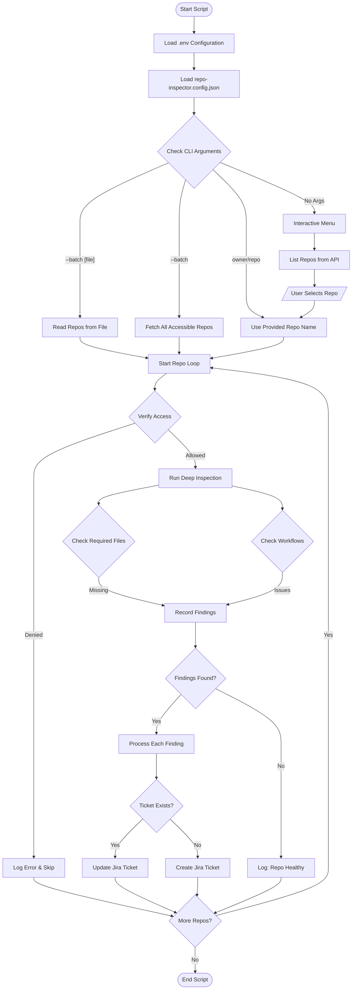

# GitHub Repo Inspector Manual

This document details the workflow and usage of the `scripts/inspect_repo.js` automation tool. This tool is designed to audit GitHub repositories for compliance with engineering standards and automatically report issues to Jira.

## 1. Overview

The Repo Inspector scans a target GitHub repository for the presence of essential files and configurations. If any required item is missing, it automatically raises a Jira Task to address the gap.

**Key Checks:**
-   **README.md**: Documentation existence.
-   **LICENSE**: Open source or proprietary license file.
-   **.gitignore**: Source control ignore rules.
-   **CI/CD Workflows**: Existence of workflow files in `.github/workflows`.

## 2. Workflow Diagram

The following flowchart illustrates the script's execution logic, including the new **CLI Arguments**, **Batch Mode**, and **External Configuration** loading:


## 3. Usage Guide

### Features
-   **CLI Support**: Run inspections directly from the command line without navigating menus.
-   **Batch Processing**: Inspect hundreds of repositories in a single run.
-   **External Configuration**: Modify inspection rules via `repo-inspector.config.json` instead of editing code.
-   **Idempotency**: Updates existing tickets to avoid spamming Jira.
-   **Smart Templates**: Auto-detects build/test commands for ticket descriptions.


### Prerequisites
Ensure your `.env` file is configured with:
-   `GHUB_TOKEN`: A GitHub Personal Access Token with `repo` and `read:org` scopes.
-   `JIRA_BASE_URL`, `JIRA_USER_EMAIL`, `JIRA_API_TOKEN`: Jira credentials.
-   `JIRA_PROJECT_KEY`: Default Jira project to create tickets in (e.g., `DOT`).
-   `ALLOWED_ORGS` (Optional): Comma-separated list of GitHub Orgs to scan.

### Running the Script

Open your terminal in the project root:

#### 1. Interactive Mode (Default)
Use this for quickly inspecting a single repo when you don't recall the exact name.
```bash
node scripts/inspect_repo.js
```
*The script will list formatted repositories and ask for a selection number.*

#### 2. Single Repo Mode (Fast)
Use this when you know the specific repository name. ideal for CI/CD pipelines.
```bash
node scripts/inspect_repo.js owner/repo-name
```

#### 3. Batch Mode (File Input)
Scan a specific list of repositories defined in a text file.
1. Create `repos.txt` (one `owner/repo` per line).
2. Run:
```bash
node scripts/inspect_repo.js --batch repos.txt
```

#### 4. Batch Mode (Scan All)
Scan **every** repository your PAT has access to (filtered by `ALLOWED_ORGS` if set).
```bash
node scripts/inspect_repo.js --batch
```

### Configuration
The tool uses `repo-inspector.config.json` for validation rules. If missing, it defaults to hardcoded values.

**Example Config:**
```json
{
  "basicFiles": ["readme.md", "license", ".gitignore"],
  "readmeChecks": {
    "minLength": 100
  },
  "workflowChecks": {
    "deprecatedActions": ["actions/checkout@v2", "actions/setup-node@v1"]
  }
}
```
 
 
 ## 4. Error Handling
 
 -   **Repo Access Denied**: Double-check your `GHUB_TOKEN` and ensure you have admin/read rights to the repository.
 -   **Jira API Errors**: 
     -   401/403: Check your Jira API Token and Email.
     -   400 (Project Required): The script handles this by prompting for a new project.
