# Sentinel: The Digital DevOps Agent

## Executive Summary

**What Is This?**
This project, "Sentinel," is an intelligent automation system that acts as a bridge between your project management tool (Jira) and your code repository (GitHub).

**Why does this matter?**
Software development involves many repetitive administrative steps: creating branches, copying descriptions, asking AI for code suggestions, and monitoring progress. This system automates all of that "busy work," allowing developers to focus on higher-level problem solving.

**The Analogy**
Think of the Sentinel as a **Junior Developer who works 24/7**.
1.  You assign them a task in Jira.
2.  **They analyze the codebase and plan the fix (Agentic AI).**
3.  They immediately start working on it.
4.  They write the initial code using AI guidance.
5.  They submit their work for review.
6.  If everything looks good (tests pass), they file it away and mark the task as "Done."

---

## The Workflow: The Life of a Ticket

To understand how the system works, let's follow a single task from start to finish.

### Phase 1: Planning (The Trigger)
*   **Human Action**: You create a ticket in Jira (e.g., "Create a new Login Page") and move it to the "To Do" column.
*   **System Response**: The Sentinel is constantly watching the "To Do" column. It spots the new ticket within 60 seconds.

### Phase 2: Execution (The Creation)
*   **System Action**: The Sentinel "reads" the ticket description to understand what needs to be built.
*   **Agentic Analysis**: It scans the repository for **Secrets** and **Structure**, then uses Azure OpenAI to draft a "Fix Strategy."
*   **AI Integration**: It sends this strategy to the **AI Coder** (GitHub Copilot CLI) and says, "Please write code to solve this problem."
*   **Code Delivery**: The AI writes the code (e.g., HTML for the login form, CSS for styling).
*   **Proposal**: The system packages this new code into a **Pull Request (PR)**. Think of a PR as a "Draft Proposal" that says, "Here is the code I wrote. Should we add it to the main project?"

### Phase 3: Review & Refinement (The Gatekeeping)
*   **Safety Checks**: The system waits for automated tests to run. These tests ensure the new code doesn't break anything existing.
*   **Draft Status**: Sometimes, the work is marked as a "Draft" or "Work In Progress (WIP)." This is a safety signal meaning "Don't merge this yet, it's not ready."
*   **Smart Management**:
    *   If the work is good to go: The system automatically approves it.
    *   If the work is stuck in "Draft": The system can intelligently "Undraft" it to keep things moving.

### Phase 4: Completion (The Merge)
*   **The Merge**: Once all checks pass, the Autopilot **Merges** the PR. This means the "Draft Proposal" creates a permanent part of the main codebase.
*   **Notification**: The system goes back to your Jira ticket, posts a comment saying "I finished this!", and moves the ticket to the "Done" column.

---

## The "Manual Override" (MCP Tools)

Sometimes, automation isn't enough. You might want to take control yourself or have another AI agent assist. We provide a **Control Panel** (called the MCP Server) with specific buttons you can push using an AI interface (like Claude):

1.  **`undraft_pr` (The "Ready" Button)**:
    *   *Scenario*: The Sentinel created a Draft PR, but you know it's actually perfect.
    *   *Action*: You use this tool to instantly mark it as "Ready for Review" so it can be merged.

2.  **`merge_pr` (The "Force Merge" Button)**:
    *   *Scenario*: Everything looks green, but the bot is hesitating.
    *   *Action*: You force the merge to happen immediately.

3.  **`add_jira_comment` (The "Note" Button)**:
    *   *Scenario*: You want to leave a record on the ticket without logging into Jira.
    *   *Action*: You post a comment directly from your AI interface.

4.  **`delete_branch` (The "Cleanup" Button)**:
    *   *Scenario*: An experiment failed and left a messy branch.
    *   *Action*: You delete the branch to keep the repository clean.

---

## The Dashboard (Your View)

We have built a visual **Dashboard** that runs in your web browser.

*   **What it looks like**: A board with columns for "Scanning", "Processing", and "Done".
*   **What it tells you**:
    *   **"Scanning..."**: "I'm looking for new work."
    *   **"Processing [Ticket-123]"**: "I'm currently writing code for Ticket 123."
    *   **"Time to Merge: 2m 30s"**: "It took me 2 minutes and 30 seconds to finish that last task."
    *   **Badges**: Small icons showing if the Autopilot worked alone or if a human used a tool to help it.
    *   **Agent Count**: A badge showing how many users are actively logged in (multi-tenant).
    *   **Copilot Status**: Indicates if GitHub Copilot is enabled for the session.

---

## Technical Appendix (For the Engineers)

While the logic is simple, the technology is robust.

*   **Server (`server.js`)**: The "Brain" running in Node.js that coordinates everything.
    *   **Multi-Tenant Agents**: Supports multiple concurrent users via `activeAgents` Map. Each OAuth login creates an isolated agent context.
    *   **Agentic AI**: Uses Azure OpenAI to plan fixes and specific workflows.
    *   **Intelligence**: Can optionally use `gh copilot` CLI to generate code fixes.
    *   **Authentication**: Uses **GitHub OAuth** to perform actions on behalf of the logged-in user (Per-User Security).
    *   **Cloud Ready**: Deployable to Azure Web App via Docker.
*   **LLM Service (`llmService.js`)**: The "Cognitive Engine" connecting to Azure OpenAI.
*   **GitHub Service (`githubService.js`)**: The "Librarian" that knows how to speak to GitHub's complex API.
*   **Jira Service (`jiraService.js`)**: The "Messenger" that translates code updates into business updates on Jira.
    *   **Dynamic Discovery**: Automatically fetches available projects via API, removing the need for manual configuration.
*   **MCP Server (`mcpServer.js`)**: The "API Layer" that allows other AIs to securely control this system.

### Glossary
*   **Pull Request (PR)**: A request to merge new code changes into the main project.
*   **Merge**: The act of combining new code into the main codebase.
*   **Deploy**: Putting the specific code onto a server (Azure Web App) where users can see it.
*   **OAuth**: Secure delegation protocol used to authenticate users against GitHub.
*   **MCP (Model Context Protocol)**: A standard way for AI models to talk to external tools and data.

### System Architecture & Execution Flow

This diagram illustrates how the different scripts in the `SENTINEL` folder interact.

```mermaid
graph TD
    %% Define Styles
    classDef core fill:#ffeb3b,stroke:#fbc02d,stroke-width:2px,color:#000;
    classDef service fill:#4fc3f7,stroke:#0277bd,stroke-width:2px,color:#000;
    classDef manual fill:#e0e0e0,stroke:#9e9e9e,stroke-width:2px,color:#000;
    classDef ai fill:#ba68c8,stroke:#7b1fa2,stroke-width:2px,color:#fff;
    classDef external fill:#fff,stroke:#333,stroke-width:2px,stroke-dasharray: 5 5;

    %% Nodes
    Server["🧠 server.js<br/>(The Engine)"]
    JiraSvc["👀 jiraService.js<br/>(The Eyes)"]
    GithubSvc["🖐️ githubService.js<br/>(The Hands)"]
    MCPServer["🤖 mcpServer.js<br/>(The Sidecar)"]
    Utils["🛠️ utils/check_boards.js<br/>(Manual Tool)"]
    
    %% External Nodes
    Copilot["✨ GitHub Copilot CLI<br/>(Optional Intelligence)"]
    JiraAPI[("Jira API")]
    GithubAPI[("GitHub API")]
    AIClient[("Clause/IDE<br/>AI Client")]

    %% Classes
    class Server core;
    class JiraSvc,GithubSvc service;
    class Utils,MCPServer manual;
    class Copilot ai;

    %% Relationships - Main Loop
    Server -->|"1. Polls (30s Loop)"| JiraSvc
    JiraSvc <-->|"Fetch Tickets / Projects"| JiraAPI
    JiraSvc -->|"Return Tickets"| Server
    
    %% Relationships - Execution
    Server -.->|"2. Write Code (If Enabled)"| Copilot
    Copilot -.->|"Return Code/YAML"| Server
    
    Server -->|"3. Create PR / Check Status"| GithubSvc
    GithubSvc <-->|"Git Operations"| GithubAPI
    
    %% Relationships - Feedback
    GithubSvc -->|"Status Update"| Server
    Server -->|"4. Update Ticket"| JiraSvc

    %% Standalone / Manual
    Utils -.->|"Manually Run"| JiraAPI
    AIClient <-->|"stdio communication"| MCPServer
    MCPServer -.->|"Calls Functions"| GithubSvc
    MCPServer -.->|"Calls Functions"| JiraSvc
    
    %% Comments
    note1[Running continuously<br/>via 'node server.js']
    note1 -.- Server
```

