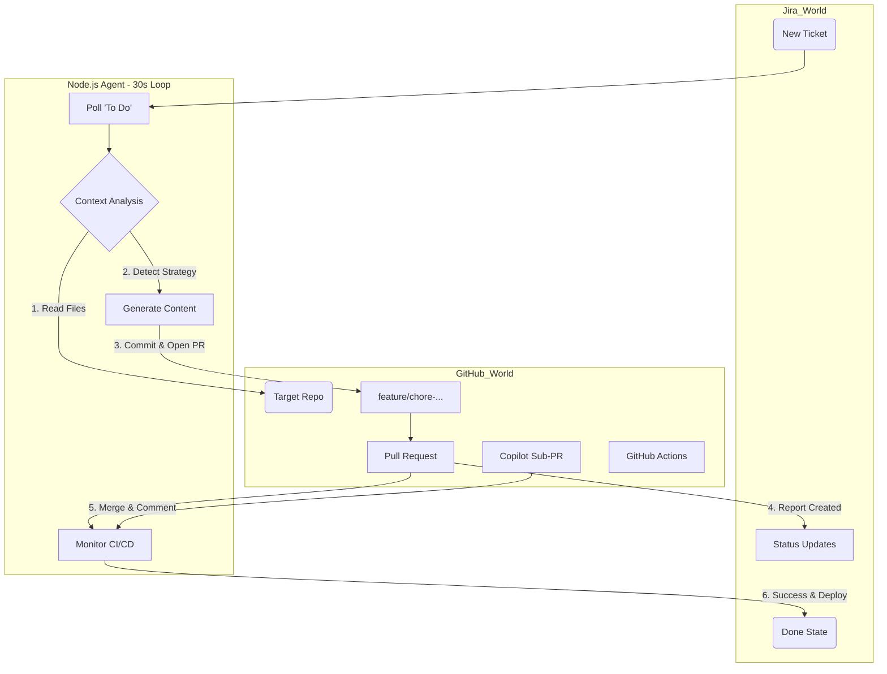

# Agents & Architecture Reference

This document serves as the technical specification for the Autonomous Agents and Interfaces in this system.

## 1. Jira Autopilot Agent
**Runtime**: Node.js (`server.js`)
**Role**: DevOps Engineer
**Loop Interval**: 30 Seconds

### Core Workflow
The agent operates on a continuous feedback loop:
1.  **Poll**: Fetches tickets from Jira (Dynamically discovered projects).
2.  **Prioritize**: Sorts tickets by Priority (Highest → Lowest).
3.  **Process**: Picks the top ticket and moves it to **"In Progress"**.
4.  **Execute**: Performs Repo Analysis, Artifact Generation, and PR Creation.
5.  **Report**:
    -   **Success**: Comments with PR Link → Transitions to **"Done"**.
    -   **Failure**: Comments with Error Log → Transitions to **"To Do"**.

### Integration Specifications

#### Jira Field Mapping
The agent looks for these fields (smart-mapped from `customfield_` or standard fields):
-   `repo` / `repoName`: Target GitHub Repository (e.g., `Unigalactix/sample-node-project`).
-   `language`: Project tech stack (`node`, `python`, `dotnet`, `java`).
-   `build`: Custom build command (e.g., `npm run build:prod`).
-   `test`: Custom test command.
-   `deploy`: Deployment target (`azure-webapp`, `docker`).

#### Context Awareness (Discovery Priority)
The agent determines how to build/test a project using this strict precedence order:
1.  **Jira Ticket**: Explicit fields override everything.
2.  **Instructions File**: Regex parsing of `.github/instructions.md`, `.github/agents.md`, or `README.md`.
    -   *Pattern*: `Build Command: "..."`
3.  **Deep Code Analysis**: Scanning specific files:
    -   `package.json` (Scripts: `build`, `test`, `start`)
    -   `pom.xml` / `build.gradle` (Maven/Gradle wrappers)
    -   `*.sln` / `*.csproj` (.NET)
    -   `requirements.txt` / `manage.py` (Python)
4.  **Language Defaults**: Fallback commands (e.g., `npm run build`).

### Construction & Deployment
-   **Branching Strategy**: Creates a stable feature branch named `chore/{issue-key}-workflow-setup`.
-   **Containerization**: Automatically generates and commits a `Dockerfile` if `deploy=azure-webapp` or `docker`.
-   **Pull Request Generation**:
    -   **Title**: `{ISSUE_KEY}: Enable CI/CD for {LANG}`
    -   **Body**: Auto-generated description including an **embedded Copilot Prompt** (`@copilot /fix ...`) to request further refinements.
-   **Secrets Management**:
    -   `ACR_LOGIN_SERVER`, `ACR_USERNAME`, `ACR_PASSWORD` (For Docker builds).
    -   `AZURE_WEBAPP_PUBLISH_PROFILE` (For Web App deployment).

---

## 2. Model Context Protocol (MCP) Interface
**Runtime**: Node.js (`mcpServer.js`)
**Role**: AI Interoperability Layer

This server exposes the internal tools of the automation service to external AI agents (like Claude Desktop).

### Exposed Tools & Resources

#### `autopilot://status` (Resource)
Returns a live JSON snapshot of the system state:
-   Active Queue
-   Processing Phase
-   Recent Scan History

#### `generate_workflow_yaml` (Tool)
**Description**: Generates a GitHub Actions CI pipeline YAML for a specific language.
**Parameters**:
-   `language`: `node` | `python` | `dotnet`
-   `repoName`: String
-   `buildCommand`: String (Optional)
-   `testCommand`: String (Optional)
-   `deployTarget`: String (Optional)

#### `check_pr_status` (Tool)
**Description**: Checks the live CI/CD status (Check Runs) of a specific PR or Branch.
**Parameters**:
-   `repoName`: String
-   `ref`: Branch name or Commit SHA
-   `autopilot://status`: A resource URI to read the live JSON state of the system queue.
-   `add_jira_comment`: Helper tool to post manual comments to tickets.

---

## Agent Workflow Diagram

