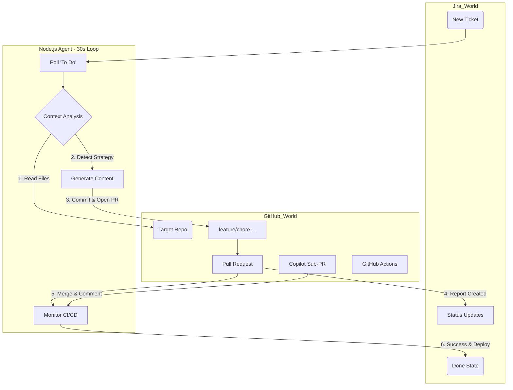

# Agents & Architecture Reference

This document serves as the technical specification for the Autonomous Agents and Interfaces in this system.

## 1. Sentinel Agent
**Runtime**: Node.js (`server.js`)
**Role**: DevOps Engineer
**Loop Interval**: 30 Seconds

### Core Workflow
The agent operates on a continuous feedback loop:
1.  **Poll**: Fetches tickets from Jira (Dynamically discovered projects).
2.  **Prioritize**: Sorts tickets by Priority (Highest → Lowest).
3.  **Process**: Picks the top ticket and moves it to **"In Progress"**.
4.  **Agentic Analysis**: Uses Azure OpenAI to discover secrets, summarize the repo, and plan the fix.
5.  **Execute**: Generates Custom Workflow (if needed) or creates Pull Request.
6.  **Report**:
    -   **Success**: Comments with PR Link → Transitions to **"Done"**.
    -   **Failure**: Comments with Error Log → Transitions to **"To Do"**.

### Integration Specifications

#### Jira Field Mapping
The agent looks for these fields (smart-mapped from `customfield_` or standard fields):
-   `repo` / `repoName`: Target GitHub Repository (e.g., `Unigalactix/sample-node-project`).
-   `language`: Project tech stack (`node`, `python`, `dotnet`, `java`).
-   `build`: Custom build command (e.g., `npm run build:prod`).
-   `test`: Custom test command.
-   `deploy`: Deployment target (`azure-webapp`, `docker`).

#### Context Awareness (Discovery Priority)
The agent determines how to build/test a project using this strict precedence order:
1.  **Jira Ticket**: Explicit fields override everything.
2.  **Instructions File**: Regex parsing of `.github/instructions.md`, `.github/agents.md`, or `README.md`.
    -   *Pattern*: `Build Command: "..."`
3.  **Deep Code Analysis**: Scanning specific files:
    -   `package.json` (Scripts: `build`, `test`, `start`)
    -   `pom.xml` / `build.gradle` (Maven/Gradle wrappers)
    -   `*.sln` / `*.csproj` (.NET)
    -   `requirements.txt` / `manage.py` (Python)
4.  **Language Defaults**: Fallback commands (e.g., `npm run build`).

### Construction & Deployment
-   **Branching Strategy**: Creates a stable feature branch named `chore/{issue-key}-workflow-setup`.
-   **Containerization**: Automatically generates and commits a `Dockerfile` if `deploy=azure-webapp` or `docker`.
-   **Pull Request Generation**:
    -   **Title**: `{ISSUE_KEY}: Enable CI/CD for {LANG}`
    -   **Body**: Auto-generated description including an **embedded Copilot Prompt** (`@copilot /fix ...`) to request further refinements.
-   **Secrets Management**:
    -   `ACR_LOGIN_SERVER`, `ACR_USERNAME`, `ACR_PASSWORD` (For Docker builds).
    -   `AZURE_WEBAPP_PUBLISH_PROFILE` (For Web App deployment).
    -   `OAUTH_CLIENT_ID`, `OAUTH_CLIENT_SECRET` (For GitHub OAuth).

---

## 2. Azure OpenAI Integration (Agentic Code)
**Module**: `src/services/llmService.js`
**Role**: Cognitive Engine

The agent uses Azure OpenAI to "reason" about the task before execution.

### Capabilities
1.  **Repo Summarization**: `summarizeRepo()` - Reads file structure and README.
2.  **Fix Planning**: `planFix()` - Correlates Jira ticket with Repo Summary.
3.  **Workflow Generation**: `generateDraftWorkflow()` - Creates YAML based on the plan and **Available Secrets**.

### Configuration via `.env`
```env
LLM_API_KEY=...
LLM_ENDPOINT=...
LLM_DEPLOYEMENT_NAME=...
```

---

## 3. Model Context Protocol (MCP) Interface
**Runtime**: Node.js (`mcpServer.js`)
**Role**: AI Interoperability Layer

This server exposes the internal tools of the automation service to external AI agents (like Claude Desktop).

### Exposed Tools & Resources

#### `sentinel://status` (Resource)
Returns a live JSON snapshot of the system state:
-   Active Queue
-   Processing Phase
-   Recent Scan History

#### `generate_workflow_yaml` (Tool)
**Description**: Generates a GitHub Actions CI pipeline YAML for a specific language.
**Parameters**:
-   `language`: `node` | `python` | `dotnet`
-   `repoName`: String
-   `buildCommand`: String (Optional)
-   `testCommand`: String (Optional)
-   `deployTarget`: String (Optional)

#### `check_pr_status` (Tool)
**Description**: Checks the live CI/CD status (Check Runs) of a specific PR or Branch.
**Parameters**:
-   `repoName`: String
-   `ref`: Branch name or Commit SHA
-   `sentinel://status`: A resource URI to read the live JSON state of the system queue.
-   `add_jira_comment`: Helper tool to post manual comments to tickets.

---

## Agent Workflow Diagram



---

## 4. Multi-Tenant Agent System (v2.1.0)
**Module**: `server.js` — `activeAgents` Map  
**Role**: Concurrent User Session Management

The system supports multiple logged-in users simultaneously. Each OAuth login creates an independent **agent context** stored in an in-memory Map keyed by `userId`.

### Agent Lifecycle
| Function | Purpose |
|----------|---------|
| `registerAgent(user, token, hasCopilot)` | Creates/updates agent on OAuth login |
| `removeAgent(userId)` | Removes agent on logout |
| `getAgent(userId)` | Looks up agent by user ID |
| `getFirstAgent()` | Fallback for single-user mode (polling) |
| `cleanupStaleAgents()` | Removes agents inactive > 1 hour (runs every 15 min) |

### Agent Context Shape
```javascript
{
  userId, token, user: { id, login, name, avatar_url, copilot_enabled },
  tickets: [], logs: [], lastActivity: Date.now(), registeredAt: Date.now()
}
```

### API Response (`/api/status`)
- `myAgent` — Current session user's agent context (no token exposed)
- `allAgents` — Sanitized list of all active agents
- `activeAgentsCount` — Total active agent count

### Dashboard
- Header displays agent count badge when > 1 user is logged in
- User avatar + login name shown for the current OAuth user
- Poll loop uses `getFirstAgent()` token when `activeUserToken` is null

---

## 5. Live Dashboard
**Runtime**: `public/index.html`  
**Role**: Real-Time Monitoring UI

### Features
- **Timer/Phase Indicator**: Shows current phase (Scanning, Processing, Waiting, Paused)
- **Terminal Feed**: Live scrolling logs from ticket processing
- **Inspection Panel**: INS board tickets fetched on independent 60-second timer
- **Pause/Resume Toggle**: Stops/starts ticket processing without logout
- **Agent Badge**: Shows active agent count in header (multi-tenant)
- **Copilot Banner**: Indicates if GitHub Copilot is enabled for the session

---

> [!IMPORTANT]
> ## 📋 Changelog Reminder
> **Every major update or implementation MUST be documented in [`CHANGELOG.md`](../CHANGELOG.md).**
>
> Before merging or deploying any significant change:
> 1. Open `CHANGELOG.md` in the project root
> 2. Add a new entry under `## [Unreleased]` or create a new version section
> 3. Categorize changes as **Added**, **Changed**, **Fixed**, or **Removed**
> 4. Include a brief, clear description of what changed and why
>
> This ensures all stakeholders can track the evolution of the system.
