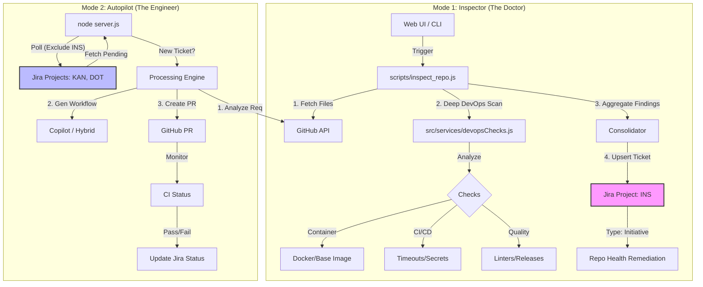

# Automation Platform: Architecture & Workflows

## 1. System Architecture

The system operates in two distinct modes: the **Inspector ("The Doctor")** and the **Autopilot ("The Engineer")**. These modes interact with specific projects in Jira to maintain a clean separation of concerns.

### Architecture Diagram



---

## 2. Workflow 1: Repository Health Inspection
**Purpose**: Proactively scan existing repositories for "DevOps Smells", security risks, and best practice violations.

*   **Trigger**: Manual (via `node scripts/inspect_repo.js`) or UI ("Inspect Repo" button).
*   **Target Board**: **INS** (Initiatives).
*   **Logic Flow**:
    1.  **Repo Access**: Verifies PAT access to the target repo.
    2.  **Basic Checks**: Checks for `README`, `LICENSE`, `.gitignore`.
    3.  **Deep DevOps Scan (`devopsChecks.js`)**:
        *   **Containerization**: Checks `Dockerfile` for `latest` tag usage (unsafe), missing `USER` (running as root), and missing `.dockerignore`.
        *   **CI/CD**: Scans `.github/workflows` for hardcoded secrets, missing job timeouts, and lock file inconsistencies.
        *   **Governance**: Checks for Branch Protection rules, `CODEOWNERS`, and `Dependabot` config.
        *   **Code Quality**: Checks for Linter configurations (`.eslintrc`, etc.) and Semantic Releases.
    4.  **Consolidation**: Instead of spamming Jira with 10+ tickets per repo, findings are aggregated into a **single Master Ticket** titled `Repo Health Remediation: <RepoName>`.
    5.  **Upsert Logic**:
        *   If an open ticket exists in **INS**, it updates the description and adds a comment.
        *   If no ticket exists, it creates a new **Initiative** ticket.

---

## 3. Workflow 2: Autopilot Remediation
**Purpose**: Automatically Process "To Do" tickets from backlog boards (KAN, DOT) to generate code and PRs.

*   **Trigger**: Continuous Polling (`server.js`).
*   **Target Boards**: All configured projects **EXCEPT** `INS`.
*   **Exclusion Logic**: The poller explicitly uses JQL `project != "INS"` to ignore the inspection reports, ensuring the Autopilot doesn't try to "fix" a generic health report without human triage.
*   **Logic Flow**:
    1.  **Poll**: Checks for tickets in `To Do` status.
    2.  **Analyze**: Reads ticket description to understand the requirement (e.g., "Add CI Pipeline", "Dockerize app").
    3.  **Generate**: Uses GitHub Copilot (CLI) or heuristic templates to generate the required code (Workflows, Dockerfiles).
    4.  **Execute**: Creates a Feature Branch and opens a Pull Request.
    5.  **Monitor**: Watches the PR CI checks.
    6.  **Complete**: Moves the Jira ticket to "In Progress" -> "Done" upon merge.

---

## 4. Key Configurations

### Board separation
| Project Key | Purpose | Managed By | Ticket Type |
| :--- | :--- | :--- | :--- |
| **INS** | Repository Health Reports | **Inspector Script** | Initiative |
| **KAN / DOT** | Feature Requests / Tasks | **Autopilot Server** | Task / Story |

### Environment Variables
*   `JIRA_PROJECT_KEY`: Default project for unrelated manual tasks (fallback).
*   `ALLOWED_ORGS`: Limits the scope of both Inspector and Autopilot to specific GitHub Orgs.

## 5. Usage Guide

### Running the Inspector
```bash
# Interactive Mode
node scripts/inspect_repo.js

# Batch Mode (from file list)
node scripts/inspect_repo.js --batch my_repos.txt
```

### Running the Autopilot
```bash
# Start background server
node server.js
```
*   **Pause/Resume**: Use the UI Toggle or `POST /api/pause` to temporarily stop the Autopilot polling if you need to perform maintenance on the backlog.
