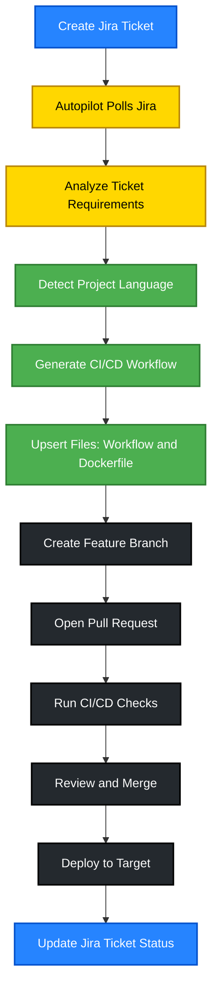

# Workflow Flow Diagram

This diagram illustrates the complete workflow process for the Jira Autopilot system, from ticket creation to deployment.

## Workflow Steps Explained

1. **Create Jira Ticket**: User creates a new ticket in Jira with requirements
2. **Autopilot Polls Jira**: System automatically polls Jira every 30 seconds
3. **Analyze Ticket Requirements**: Extracts repository, language, and deployment info
4. **Detect Project Language**: Identifies tech stack (Node.js, .NET, Python, Java)
5. **Generate CI/CD Workflow**: Creates GitHub Actions workflow file
6. **Upsert Files: Workflow and Dockerfile**: Updates or creates workflow files and Dockerfile
7. **Create Feature Branch**: Creates a feature branch for the changes
8. **Open Pull Request**: Opens a PR with the generated files
9. **Run CI/CD Checks**: Executes automated tests and builds
10. **Review and Merge**: Reviews PR and merges if checks pass
11. **Deploy to Target**: Deploys application to Azure or container registry
12. **Update Jira Ticket Status**: Marks ticket as complete in Jira
