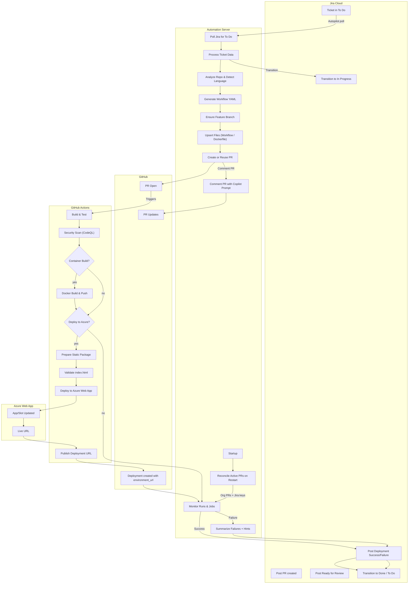

# CI/CD Automation Flow (Visio-style)

Below is a high-level flow diagram (Mermaid) showing how the system moves from Jira tickets → Pull Requests → GitHub Actions → Azure → Jira updates, including monitoring and reconciliation on server restarts.

Key Notes
- Build/Test defaults when missing: `npm run build` / `npm test`.
- Static-site deploys package only `public/` or a minimal `deploy/` folder; validates `index.html`.
- Deployment URL published via GitHub Deployments and included in Jira comments.
- On restart, the server reconciles open org PRs → seeds monitoring for tickets in active statuses.

How to View
- GitHub renders Mermaid diagrams natively in Markdown.
- In VS Code: open docs/workflow-flow.md and use “Open Preview”.
